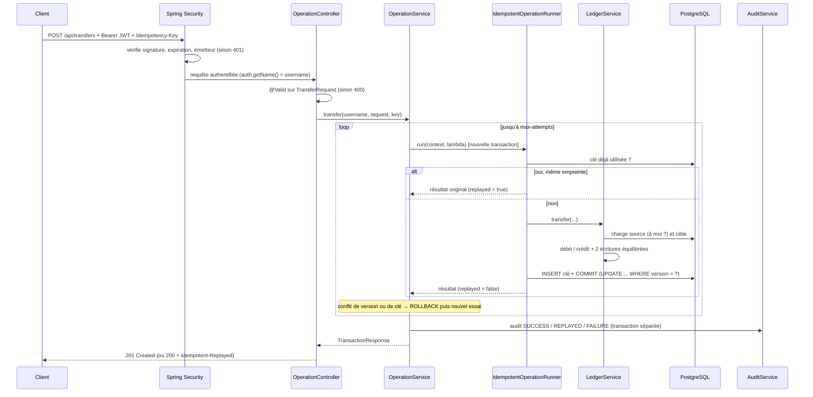

# Guide de lecture du projet

Ce guide explique **pourquoi** le code est écrit ainsi. Lisez-le avec le code ouvert à côté : chaque section renvoie aux classes concernées, qui sont elles-mêmes commentées en détail.

**Ordre de lecture conseillé :**

1. `money/Money`
2. `account/Account`
3. `ledger/LedgerTransaction`
4. `ledger/LedgerService`
5. `operation/IdempotentOperationRunner`
6. `operation/OperationService`
7. `config/SecurityConfig`
8. les tests `*IT`

---

## 1. Architecture en couches

```
HTTP ──► Controller ──► Service ──► Repository ──► PostgreSQL
         (web)          (métier)    (Spring Data)
```

| Couche | Rôle | Exemple |
|---|---|---|
| **Controller** | Lire la requête HTTP, valider le JSON (`@Valid`), appeler un service, renvoyer un code HTTP. Aucune règle métier. | `OperationController` |
| **Service** | Règles métier et transactions (`@Transactional`). | `LedgerService`, `OperationService` |
| **Repository** | Accès aux données. Spring Data génère le SQL à partir du nom des méthodes. | `AccountRepository.findByIdAndOwner_Username` |
| **Entité** | Objet Java ↔ ligne de table (JPA/Hibernate). Porte aussi ses propres règles : `Account.debit()` refuse le découvert. | `Account`, `LedgerEntry` |
| **DTO** | Ce qui entre et sort en JSON. On n'expose jamais une entité directement. | `TransferRequest`, `TransactionResponse` |

Les packages sont organisés **par fonctionnalité** (`account`, `ledger`, `operation`…), pas par couche : tout ce qui concerne un sujet est au même endroit.

---

## 2. La comptabilité en partie double

**Principe :** l'argent ne se crée pas et ne disparaît pas ; il se *déplace*. Chaque mouvement est enregistré deux fois :

- une ligne **DÉBIT** sur le compte qui perd l'argent ;
- une ligne **CRÉDIT** sur le compte qui le reçoit ;
- pour un montant **identique**.

| Opération | DÉBIT (solde ↓) | CRÉDIT (solde ↑) |
|---|---|---|
| Dépôt de 100 MAD | compte de règlement MAD | portefeuille d'Alice |
| Transfert de 30 MAD | portefeuille d'Alice | portefeuille de Bob |
| Retrait de 20 MAD | portefeuille de Bob | compte de règlement MAD |

**Pourquoi un compte de règlement (SYSTEM) ?** Lors d'un dépôt, l'argent vient « de l'extérieur » (carte bancaire, virement). Le compte de règlement représente cet extérieur, c'est-à-dire l'argent réel détenu par la plateforme à la banque. Sans lui, un dépôt aurait un crédit sans débit, et le modèle ne serait plus équilibré.

**Ce que ça garantit :**

- Σ débits = Σ crédits pour chaque transaction, vérifié par `LedgerTransaction.verifyBalanced()` et par un test SQL.
- Un bug ne peut pas « créer » d'argent sans que les totaux deviennent faux, ce qui le rend détectable.
- L'historique est complet et immuable : on ne modifie jamais une écriture, on en ajoute une nouvelle qui la corrige.

**Deux sources du solde :**

- `ledger_entries` est **la vérité**.
- `accounts.balance` est un **cache** pour lire vite.

Les deux sont mis à jour dans la même transaction. L'endpoint `/reconciliation` et `assertLedgerConsistent()` dans les tests vérifient qu'ils concordent.

---

## 3. Les montants : `BigDecimal`

```java
0.1 + 0.2                                           // 0.30000000000000004  ← double : faux
new BigDecimal("0.1").add(new BigDecimal("0.2"))    // 0.3                  ← exact
```

Règles appliquées dans `Money.normalize` :

- Le montant doit être strictement positif.
- Il ne peut pas avoir plus de 2 décimales. On **refuse** au lieu d'arrondir, car arrondir déplacerait un montant que le client n'a pas demandé.
- Toujours comparer avec `compareTo`, jamais avec `equals` : `1.0` et `1.00` ne sont pas `equals`.

Le client indique toujours la devise. Si elle ne correspond pas à celle du compte, la réponse est **422** `CURRENCY_MISMATCH`. Il n'y a pas de conversion implicite MAD ↔ EUR.

---

## 4. Les transactions (`@Transactional`)

Une transaction de base de données est **tout ou rien**. Dans un transfert, le débit d'Alice, le crédit de Bob, les deux écritures et la clé d'idempotence sont validés ensemble (COMMIT) ou annulés ensemble (ROLLBACK). Il ne peut jamais y avoir un débit sans crédit correspondant.

Toute exception non vérifiée (`RuntimeException`) levée dans une méthode `@Transactional` provoque un ROLLBACK. C'est pour cela que toutes nos erreurs métier héritent de `BusinessException extends RuntimeException`.

**Piège classique : l'auto-invocation.** Spring implémente `@Transactional` avec un *proxy* qui entoure le bean. Si une méthode appelle une autre méthode du **même** objet (`this.run()`), l'appel ne passe pas par le proxy et aucune transaction ne démarre.

C'est pourquoi la méthode transactionnelle (`IdempotentOperationRunner.run`) est dans une classe différente de la boucle de relance (`OperationService`).

---

## 5. Concurrence : le verrouillage optimiste

**Le problème (« mise à jour perdue ») :**

```
Solde = 100
Requête A lit 100 ──┐
Requête B lit 100 ──┤   (en même temps)
A écrit 100-80 = 20 │
B écrit 100-80 = 20 ┘   → 160 sont sortis, mais seuls 80 ont été retirés du solde !
```

**La solution : `@Version`.** Hibernate ajoute un numéro de version à la ligne :

```sql
UPDATE accounts SET balance = 20, version = 8 WHERE id = ? AND version = 7
```

- A met à jour la ligne : version 7 → 8.
- B exécute la même requête avec `version = 7`, qui ne correspond plus. **0 ligne** modifiée, donc Hibernate lève une `OptimisticLockException`.
- `OperationService` relance B dans une **nouvelle** transaction. B relit alors le solde (20) et la version (8), puis `debit(80)` lève `InsufficientFundsException` et la réponse est **422**.

On parle de verrouillage « optimiste » parce qu'on ne verrouille rien à l'avance : on parie que les conflits sont rares et on les détecte au moment de l'écriture. L'alternative « pessimiste » (`SELECT … FOR UPDATE`) bloque les autres requêtes pendant toute la transaction.

**Attente entre les tentatives.** Le délai augmente à chaque tentative (backoff linéaire), avec une part aléatoire (*jitter*). Sans cette part aléatoire, dix requêtes en conflit se relanceraient toutes exactement au même moment et entreraient à nouveau en collision.

**Compte « chaud ».** Les comptes SYSTEM participent à tous les dépôts et retraits. S'ils étaient versionnés, tous les dépôts de la plateforme entreraient en conflit entre eux. Ils ne gardent donc pas de solde en cache : leur position se calcule depuis le grand livre.

---

## 6. L'idempotence (`Idempotency-Key`)

**Le problème :** le client envoie un transfert, le réseau coupe, le client ne reçoit pas la réponse. Il ne peut pas savoir si le transfert a eu lieu. S'il réessaie, il risque un **double débit**.

**La solution :**

1. Le client génère une clé unique par transfert (un UUID) et l'envoie dans l'en-tête `Idempotency-Key`.
2. Le serveur mémorise « clé → transaction » **dans la même transaction SQL** que le mouvement d'argent.
3. Si la même clé revient :
   - Même contenu : on renvoie le résultat original (**200** + `Idempotent-Replayed: true`) sans rien débiter.
   - Contenu différent : **422** `IDEMPOTENCY_KEY_REUSED`. C'est un bug côté client, et on le signale.

**Deux requêtes identiques en même temps.** Aucune ne trouve la clé, donc les deux exécutent le transfert. La contrainte `UNIQUE (username, idempotency_key)` de PostgreSQL fait alors échouer l'INSERT de la seconde. Toute sa transaction est annulée, débit compris. À la tentative suivante, elle trouve la clé de la première et renvoie son résultat.

La garantie repose donc sur **la base de données**, pas sur du code Java qui « vérifierait avant d'écrire » : un tel code laisserait passer deux requêtes simultanées.

**Empreinte de la requête.** Une empreinte SHA-256 de la requête (`RequestFingerprint`) permet de reconnaître une vraie nouvelle tentative. `100`, `100.0` et `100.00` produisent la même empreinte.

---

## 7. Parcours complet d'un transfert



---

## 8. Sécurité

- **JWT.** Le jeton est *signé*, pas *chiffré* : son contenu est lisible par tous (essayez-le sur jwt.io). Il ne contient donc rien de secret, seulement le nom d'utilisateur, le rôle et l'expiration. La signature HS256 prouve qu'il vient de nous.
- **Sans état (stateless).** Il n'y a pas de session serveur : chaque requête apporte sa preuve d'identité. CSRF est désactivé car aucun cookie n'est utilisé.
- **Mots de passe.** Ils sont hachés avec BCrypt, un algorithme lent et salé. Le mot de passe en clair n'est jamais stocké.
- **Isolation.** Le nom d'utilisateur vient toujours du jeton, jamais du corps de la requête. Le compte d'un autre utilisateur renvoie **404** et non 403, pour ne pas révéler qu'il existe.
- **Messages d'erreur.** Le message de connexion est identique que l'utilisateur n'existe pas ou que le mot de passe soit faux. Les erreurs inattendues renvoient un message générique, et la trace complète ne va que dans les logs.

---

## 9. Audit

Chaque action est tracée avec son issue :

- `SUCCESS`
- `FAILURE`
- `REPLAYED` (nouvelle tentative idempotente)

Les actions tracées sont l'inscription, la connexion, l'ouverture de compte, les dépôts, les retraits et les transferts.

L'écriture se fait en `REQUIRES_NEW`, c'est-à-dire dans une transaction séparée. Sans cela, l'annulation d'un transfert échoué effacerait aussi la ligne d'audit, alors que ce sont souvent les échecs qui intéressent la sécurité.

---

## 10. Les erreurs (RFC 7807)

Toutes les erreurs ont la même forme JSON :

```json
{ "status": 422, "title": "Unprocessable Entity",
  "detail": "Insufficient funds on account 3f2c…", "code": "INSUFFICIENT_FUNDS" }
```

| Code HTTP | Signification | Exemples |
|---|---|---|
| 400 | Requête mal formée | montant `10.001`, JSON invalide, en-tête manquant |
| 401 | Non authentifié | jeton absent, expiré ou faux ; mauvais mot de passe |
| 404 | Introuvable (ou pas à vous) | `ACCOUNT_NOT_FOUND` |
| 409 | Conflit | `USERNAME_TAKEN`, `CONCURRENT_UPDATE` |
| 422 | Refus métier | `INSUFFICIENT_FUNDS`, `CURRENCY_MISMATCH`, `IDEMPOTENCY_KEY_REUSED` |

Le client doit se baser sur `code`, qui est stable, et jamais sur `detail`, qui est un message pour les humains et peut changer.

---

## 11. La stratégie de tests

| | Tests unitaires (`*Test`) | Tests d'intégration (`*IT`) |
|---|---|---|
| Quoi | une classe isolée | l'application entière |
| Dépendances | simulées avec Mockito (`@Mock`, `when(...).thenReturn(...)`) | réelles : HTTP, Spring Security, PostgreSQL via Testcontainers |
| Vitesse | millisecondes | quelques secondes (démarrage de Docker) |
| Prouvent | les règles : découvert, arrondis, relances, rejeu | que tout fonctionne ensemble, **y compris en concurrence** |

Les tests de concurrence lancent 10 à 20 requêtes au même instant (grâce à un `CountDownLatch`). Ils vérifient ensuite les invariants directement en SQL :

- aucun solde négatif ;
- le cache égale le grand livre ;
- chaque transaction est équilibrée ;
- une seule transaction par clé d'idempotence.

JaCoCo mesure la couverture pendant `mvn verify` et génère le rapport `target/site/jacoco/index.html`.

---

## 12. Questions fréquentes en entretien

- **Pourquoi ne pas utiliser `double` pour l'argent ?** À cause de l'arithmétique binaire : voir la section 3.
- **Optimiste ou pessimiste ?** Le verrouillage optimiste est adapté quand les conflits sont rares, car il ne bloque personne. Le pessimiste l'est quand ils sont fréquents. Pour un compte très sollicité, on peut aussi supprimer le cache, comme nous l'avons fait pour les comptes SYSTEM.
- **Comment garantir « pas de double débit » ?** La clé d'idempotence est enregistrée dans la même transaction que le mouvement, avec une contrainte UNIQUE en base.
- **Pourquoi deux sources du solde ?** Les écritures sont la vérité et permettent l'audit ; le cache sert à lire vite ; l'endpoint de rapprochement vérifie la cohérence des deux.
- **Pourquoi 404 et pas 403 ?** Pour ne pas révéler l'existence du compte d'un autre utilisateur.
- **Que ferait-on ensuite ?**
  - un TTL sur les clés d'idempotence ;
  - la conversion de devises avec des taux horodatés ;
  - le pattern *outbox* pour publier des événements ;
  - un rôle ADMIN ;
  - des jetons de rafraîchissement (refresh tokens).
